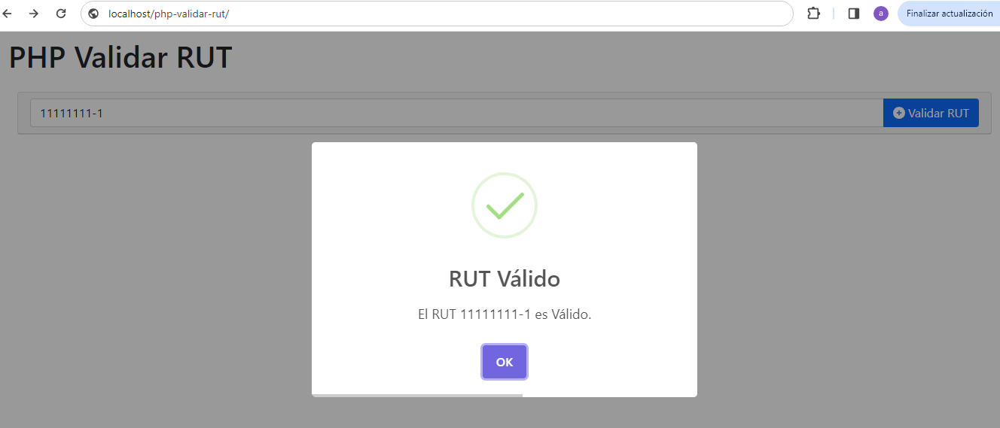
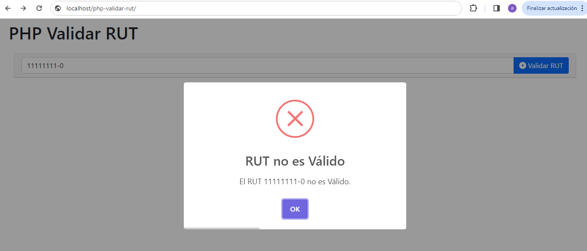

# php-validar-rut
PHP 7, PHP 8 que permite Validar RUT chileno

Para el cálculo de RUT en Chile, se utiliza el [Algoritmo del Módulo 11](https://es.wikipedia.org/wiki/C%C3%B3digo_de_control#M%C3%B3dulo_11)


## Librerias
- [ ] jquery-3.7.1. [https://jquery.com/download/]
- [ ] Bootstrap 5.1 [https://getbootstrap.com/docs/5.1/getting-started/download/]
- [ ] sweetalert2 [https://sweetalert2.github.io/#download]
- [ ] Font Awesome Free 6.5.1 [https://fontawesome.com/download]


## Clonar Repositorio
```
git clone https://github.com/compuvalpo/php-validar-rut.git
```


## Lavantar Repositorio en local
Una vez clonado el repositorio en su carpeta de Apache [www - htdocs - html - u otra según su versión] debe acceder a la siguiente url
`http://localhost/php-validar-rut`


## Capturas

